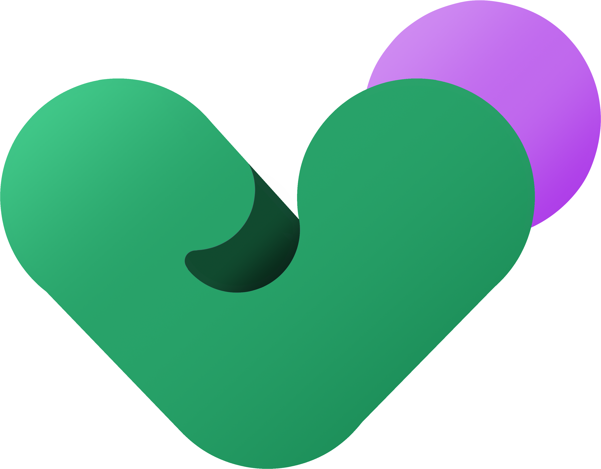

<div align="center">
    
</div>

# VuejsBOBuilder

💡 Build a scalable and customisable CRUD Back-Office based on API services with very simple json config. 💡

🚧 Work In Progress 🚧

#
## CONFIGURATION
The application uses a `.json` file to build the entire CRUD application. 
For the reading and the writing, the configuration is divide into different `.json` files.
A service will merge all config files in one.

### ENTITIES
In the directory `config/entities` you will have a `.json` file for each model you want a CRUD.

An entity config look like this :
```json
{
  "name": "<Name of the entity/resource>",
  "icon": "<Icon used in sidebar menu>",
  "url": "<Url used in front>",
  "api": "<optionnal>",
  "schema": []
}
```

The key `api` is optional because by default, the url path is retrieves from `config/common/api/default_api.json` 
and a service will merge and provide default endpoints like this :
```json
{
    "endpoints": {
      "fetchAll": {
        "url": "${resource}s"
      },
      "fetchOne": {
        "url": "${resource}s/:id"
      },
      "create": {
        "url": "${resource}s"
      },
      "update": {
        "url": "${resource}s/:id"
      },
      "delete": {
        "url": "${resource}s/:id"
      }
    }
}
```

#### EXAMPLE
So for example, for the comment entity :

```json
{
  "name": "comment",
  "icon": "chat",
  "url": "/comment",
  "schema": [
    "name",
    "email",
    { 
      "key": "postId",
      "type": "entity-select",
      "inputType": "post",
      "label": "postId",
      "model": "postId",
      "convertToString": ["title"],
      "isRelation": true
    },
    {
      "key": "body",
      "type": "textArea",
      "label": "body",
      "model": "body",
      "placeholder": "Entrer un corps de message"
    }
  ]
}
```

### COMMON
In order to simplify the writing, and the reading of entity config file,
it's possible to define common config files.

#### API
Like we saw just before, the `default_api.json` provide the default url of the api.
 
#### FIELDS
On the comment example, in the schema, we have a `name` field. 
It's a common field (can be use in others entity config file). 
So, in `config/common/fields/name.json` you will have the simple field config
```json
{
  "key": "name",
  "type": "input",
  "inputType": "text",
  "label": "Nom",
  "model": "name"
}
```
After That, you will be able to just use `"name"` in entity schema config.

### FEATURES
A simple `.json` file to active or deactivate application features.
```json
{
  "clock": true
}
```

#
## VIEWS
CRUD view, Login, home
### DEFAULT VIEWS
CRUD :
* `views/defaultView/DefaultDataTable`,
* `views/defaultView/DefaultEditEntity`,
* `views/defaultView/DefaultCreateEntity`

#### SLOTS

### EXTENDED VIEWS
`views/extendedViews/<resource>`
and have to be the same name of default views

#
## Project commands
```
yarn install
yarn serve
yarn build
yarn lint
```